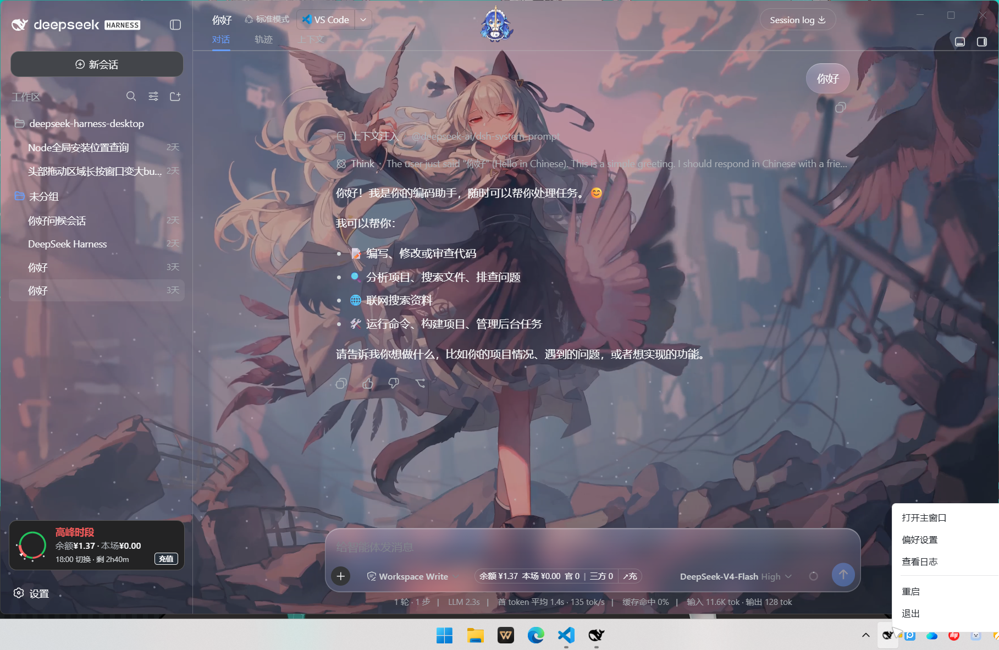

<div align="center">
  
  <h1>DeepSeek Harness Desktop</h1>
  <p>基于 Electron 的轻量级 DeepSeek Harness 桌面壳 · Native-First · 零框架</p>
  <p>
    
    
    = 18" />
    
    
  </p>
</div>

> **「简洁」是最大的优势** —— 不捆绑运行时、不引入框架、不改动上游，
> 只做窗口、托盘、快捷键与安全隔离，其余交给系统里的 `dsh web`。

---

## 简介

DeepSeek Harness Desktop Simple是一个基于 Electron 的轻量桌面壳，采用 **Native-First** 架构：

- 主进程仅依赖 Node.js 内置模块 + 自动更新（`electron-updater`），托盘为原生 Tray + BrowserWindow 实现，**零前端框架**；
- 前端纯原生 HTML/CSS/JS，**不引入任何框架**；
- 不捆绑 DeepSeek 本体，直接调用系统已安装的 `dsh web` CLI 拉起本地 Web 服务，
  再用 BrowserWindow 嵌入展示。

你只需在系统中安装 Node.js 和 DeepSeek Harness CLI，桌面壳负责窗口管理、托盘、
快捷键和安全隔离。升级 `dsh` 即升级能力，桌面壳保持「薄」且「透明」。

## 特性

- 🚀 调用系统 `dsh web` 启动本地 Web 服务，BrowserWindow 嵌入展示；
  启动失败（dsh 未安装）则弹窗提示并退出
- 🪟 Windows 下 Acrylic 亚克力背景 + 透明 `titleBarOverlay`；
  macOS 下 `hiddenInset` 红绿灯 + sidebar 毛玻璃效果；
  Linux 下原生窗口边框 + `titleBarOverlay` 按钮覆盖层
- 🎨 悬浮标题栏拖拽：纯 DOM 事件 → `setBounds` 显式钉住宽高，
  规避 Electron `setPosition` 篡改尺寸的核心 bug，4px 阈值防误触，交互控件零遮挡
- 📋 托盘菜单（纯原生 Tray + BrowserWindow 实现，零第三方依赖）：
  Windows/Linux 菜单定位鼠标右上角，macOS 定位菜单栏图标正下方；
  左键单击显隐主窗口，右键打开菜单；支持查看日志、打开命令行、重启等操作
- ⌨️ 全局快捷键显示/隐藏主窗口，默认 `Ctrl+Shift+Space`（macOS 下为 `Cmd+Shift+Space`），设置页支持实时录制
- 🔋 开机自启（打包后生效），静默启动时只出托盘不弹窗口
- ⚙️ 设置覆盖层（注入到主窗口上方）提供：
  - **环境** — Node.js / npm / dsh 版本检测与一键更新，安装 dshmarket 插件市场
  - **常规** — 快捷键录制器 + 开机自启 Switch + 乐观更新 + Toast 提示
  - **关于** — 版本信息 + 自动更新状态与手动检查
- 🔲 标题栏双击最大化/还原
- 🔒 安全加固：`contextIsolation` + `sandbox` + 权限拒绝 + 导航限制 +
  外部链接用浏览器打开 + 弹窗 deny
- 🧹 退出时进程树终止（Windows `taskkill /t`，Linux/macOS `SIGTERM` 进程组），
  单实例锁防多开，第二实例自动唤起主窗口；关闭主窗口时隐藏到托盘而非退出
- 🔄 托盘菜单支持应用重启，重启前清理 UI 和子进程
- 🔁 内置自动更新：安装版（NSIS）使用 electron-updater 静默更新，便携版通过 GitHub API 手动下载升级

## 预览



## 与其他 DSH 桌面壳的对比

详见 [docs/COMPARISON.md](docs/COMPARISON.md) —— 包含三项目对比表格，以及
dsh-desktop（anywhere-labs）与 deepseek-harness-desktop（Tauri 版）两个参考项目的
详细优劣势分析。


## 快速开始

### 环境安装

本桌面壳依赖 Node.js 与 DeepSeek Harness CLI，首次使用请按以下步骤安装：

#### 1. 安装 Node.js

访问 [Node.js 官网](https://nodejs.org/) 下载 **LTS 版本（>= 18）** 安装包：

- **Windows**：下载 `.msi` 安装包，双击运行，勾选「Add to PATH」→ 一路 Next 即可

#### 2. 安装 DeepSeek Harness CLI

```bash
npm install -g deepseek-harness

dsh --version   # 安装完成后验证：应正常输出版本号
```

> 如果 `dsh` 命令不可用，请检查 npm 全局 bin 目录是否在系统 PATH 中。
> Windows 下通常为 `%APPDATA%\npm`，macOS/Linux 下通常为 `/usr/local/bin`。

### 插件市场（dshmarket）

桌面壳「设置 → 环境」页提供一键安装 **dshmarket** 插件市场：
`dsh --profile web plugin add dshmarket`。它用于在 DSH Web 内浏览、搜索并
一键安装社区插件。

## 配置

用户偏好持久化到 `config.json`，路径遵循 dsh 插件标准：

- 开发模式：项目根目录 `config.json`
- 打包后：`$DSH_HOME/storages/deepseek-harness-desktop/config.json`

存储内容包括：全局快捷键、开机自启开关、自动更新镜像与开关等，均可通过设置覆盖层可视化修改。

## 项目结构

```
DeepSeek Harness/
├── main.js                  # 入口（单实例锁 + app 事件 + 启动调度）
├── src/
│   ├── autostart.js         # 开机自启管理
│   ├── constants.js         # 常量与纯工具函数
│   ├── dsh-home.js          # dsh 规范 home 路径解析（~/.dsh）
│   ├── env.js               # 运行时模式 + 环境检测与更新
│   ├── host.js              # dsh web 子进程管理（spawn / 就绪 / 终止）
│   ├── ipc.js               # IPC 处理器（设置 / 日志 / 拖拽 / 窗口控制）
│   ├── lifecycle.js         # 应用生命周期（bootstrap / 退出 / 重启）
│   ├── state.js             # 全局状态 + 日志基础设施 + 进程守卫
│   ├── store.js             # 配置存储（config.json）
│   ├── tray.js              # 托盘 + 托盘菜单（原生 Tray + BrowserWindow，零第三方依赖）
│   ├── updater.js           # 自动更新（安装版 electron-updater + 便携版手动下载）
│   ├── windows.js           # 窗口管理（创建 / 导航 / 显示切换）
│   ├── preload/
│   │   ├── preload-tray.js      # 托盘菜单 preload
│   │   └── preload-main.js      # 主窗口 preload（拖拽 API + 设置覆盖层）
│   └── settings-overlay/
│       ├── settings-overlay.html # 设置覆盖层 HTML 结构
│       ├── settings-overlay.js   # 设置覆盖层 JS 逻辑
│       └── style.css             # 设置覆盖层样式
├── assets/
│   ├── app.ico
│   ├── favicon.ico
│   └── favicon.svg
└── package.json
```

## 架构

```
┌──────────────────────────────────────────────┐
│  main.js（入口）                              │
│   单实例锁 → app 事件 → bootstrap 调度        │
└──────────────────┬───────────────────────────┘
                   │
┌──────────────────▼───────────────────────────┐
│  主进程（src/）                               │
│  lifecycle  ·  windows  ·  tray  ·  ipc      │
│  host（dsh web 子进程） ·  store ·  env      │
│  updater（自动更新） ·  state（日志 + 进程守卫）│
└───────┬───────────────────────────┬──────────┘
        │ BrowserWindow              │ spawn
┌───────▼──────────────┐   ┌──────────▼──────────┐
│ 主窗口（dsh Web）     │   │  dsh web CLI        │
│  preload-main         │   │  → 127.0.0.1:动态端口│
│  + 拖拽注入脚本        │   │  DSH_HOME=~/.dsh   │
│  + 设置覆盖层注入       │   └─────────────────────┘
└───────────────────────┘
```

- **主进程**：纯 Node 内置模块 + Electron API + `electron-updater`，模块职责单一（见项目结构）。
- **渲染进程**：主窗口加载 dsh Web + 注入设置覆盖层；设置页为纯原生页面，通过 preload 暴露的最小
  IPC 面与主进程通信（`contextIsolation` + `sandbox`）。
- **数据流**：`dsh web` 子进程 → 本地 HTTP 服务 → BrowserWindow 内嵌展示；
  主进程只做窗口、托盘、快捷键、更新与生命周期管理。

## 安全

- 所有窗口开启 `contextIsolation` + `sandbox`，渲染进程无 Node 权限
- preload 仅暴露白名单通道，拒绝未知 IPC
- 导航限制：禁止外部 URL 加载进应用窗口，外部链接一律交给系统浏览器
- 弹窗（`window.open`）一律 deny
- 托盘菜单 preload 最小权限（仅 `tray-menu-select`）

## 已知限制

- **需要预装环境** — 需系统已安装 Node.js（>= 18）与 dsh CLI，不提供「下载即用」的捆绑运行时；
- **dsh 更新** — 桌面壳本身支持自动更新，但 dsh CLI 仍需在设置页「环境」标签手动更新；
- **平台支持** — 已配置 Windows（NSIS + Portable）/ Linux（AppImage + deb + rpm）/
  macOS（dmg + zip）跨平台构建与 CI，但 Linux / macOS 仅完成「构建层面」的支持，
  **未经真机充分验证**，运行期表现详见下方[多平台测试](#多平台测试)清单；
- **运行时依赖** — 仅 1 个第三方运行时依赖（`electron-updater` 自动更新）；
- **上游兼容** — 跟随系统 `dsh` 版本，上游破坏性变更可能影响桌面壳（与 Tauri 版一致）。

## 多平台测试

> **关于 macOS 的补充说明**：本项目的持续集成环境不包含 Apple 签名证书，发布产物为
> **未签名**应用。首次打开需右键 →「打开」绕过 Gatekeeper 拦截，或由维护者自行配置
> `CSC_LINK` / `CSC_KEY_PASSWORD` 后重新构建签名版本。

### Linux（尚未真机验证）

> 构建已通过 AppImage / deb / rpm，以下运行期行为**必须**在真机（建议 GNOME / KDE，
> 分别覆盖 X11 与 Wayland 会话）上验证：

- [ ] **托盘图标与菜单** — 托盘图标能否正常显示（当前使用 `.ico`，需确认 Linux 下
  `nativeImage` 能正确解码）；左键显隐窗口、右键打开菜单的定位方向是否正确；
  靠近屏幕边缘时菜单是否会溢出到屏幕外
- [ ] **窗口边框与背景** — Linux 下 `frame` + `titleBarStyle` + `transparent`
  组合实际渲染效果；Wayland 会话下透明背景是否失效、原生标题栏是否遮挡内容
- [ ] **开机自启** — `app.setLoginItemSettings` 在 Linux 下是否生效/兜底，设置页
  开关是否有异常；`.desktop autostart` 是否随桌面环境正常工作
- [ ] **进程树清理** — 退出/重启后确认 `dsh` 子进程及其派生进程被整组终止
  （`process.kill(-pid)` 依赖 `detached` 生效），无残留孤儿进程
- [ ] **全局快捷键 / 单实例锁 / 关闭隐藏到托盘** — 与 Windows 一致的核心交互是否正常

### macOS（尚未真机验证）

> 构建已通过 dmg / zip（x64 + arm64），以下运行期行为**必须**在真机上验证：

- [ ] **托盘图标** — macOS 下 `nativeImage.createFromPath` 读取 `.ico`（`favicon.ico`）
  是否返回空图标（NSImage 对 ICO 支持有限）。若为空则需改用 `.png`/`.icns`
- [ ] **托盘菜单定位** — macOS 不 monkey-patch `applyWindowPosition`，验证菜单是否
  正常定位在菜单栏图标正下方，尺寸是否被 `setSize` 正确自适应
- [ ] **窗口毛玻璃与红绿灯** — `hiddenInset` 红绿灯位置 / `trafficLightPosition` /
  `vibrancy: sidebar` 毛玻璃/半透明效果是否如实呈现，`setBounds` 拖拽是否正常
- [ ] **开机自启** — `setLoginItemSettings` 的 LoginItem 是否注册、移除成功
- [ ] **签名与 Gatekeeper** — 未签名.dmg 安装后右键→打开是否可运行；
  entitlements 是否满足硬编码运行时（hardenedRuntime）要求

### 跨平台通用（每次发版必测）

- [ ] **`dsh web` 拉起与就绪检测** — Node/npm/dsh 版本检测、「一键更新」与插件安装
  命令（`windowsHide` 相关差异）在各平台 CLI 输出解析是否一致
- [ ] **日志行为** — `$DSH_HOME/logs/` 路径与写入在各平台的读线程/权限是否正常

## 常见问题

**Q：启动提示「dsh 未安装」？**
A：请先安装 [Node.js](https://nodejs.org/)（>= 18）与 DeepSeek Harness CLI，
并确保 `dsh` 在系统 PATH 中可用。

**Q：与 dsh-desktop / Tauri 版有什么区别？**
A：见[对比章节](#与其他-dsh-桌面壳的对比)。本项目的定位是「简洁」——
约 3.6k 行代码、零框架、易修改，桌面体验（窗口铺满、自定义标题栏、快捷键、
类原生托盘）完整；对比结论基于对三个项目源码的完整阅读。

**Q：日志文件在哪里？**
A：开发模式在项目根目录 `logs/host.log`；打包后位于 `$DSH_HOME/logs/deepseek-harness-desktop/`。
可通过托盘菜单「查看日志」打开。

## 贡献

欢迎提交 Issue 与 PR！

- 代码风格：主进程仅使用 Node 内置模块，前端纯原生，不引入框架
- 提交前请确保 `node --check` 通过全部 JS 文件
- 涉及重命名时请全局搜索调用点，避免遗漏

## 开源协议

基于 [MIT License](./LICENSE) 开源。

「DeepSeek Harness」为深度求索公司的商标，本文仅用于准确说明兼容性与技术来源。
本项目为独立社区项目，与深度求索不存在隶属、合作、授权或背书关系。
