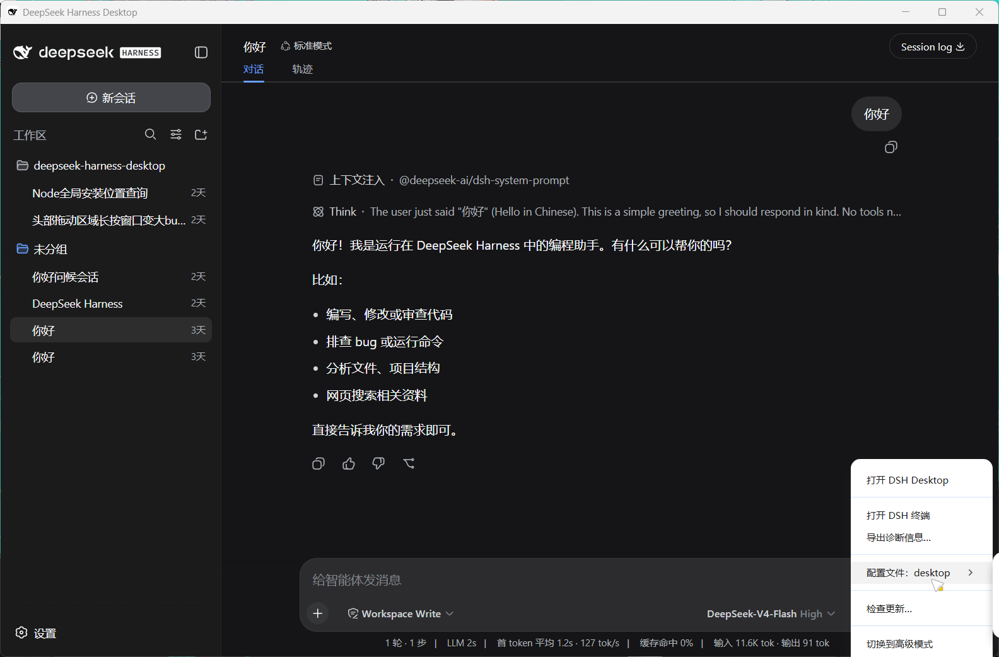
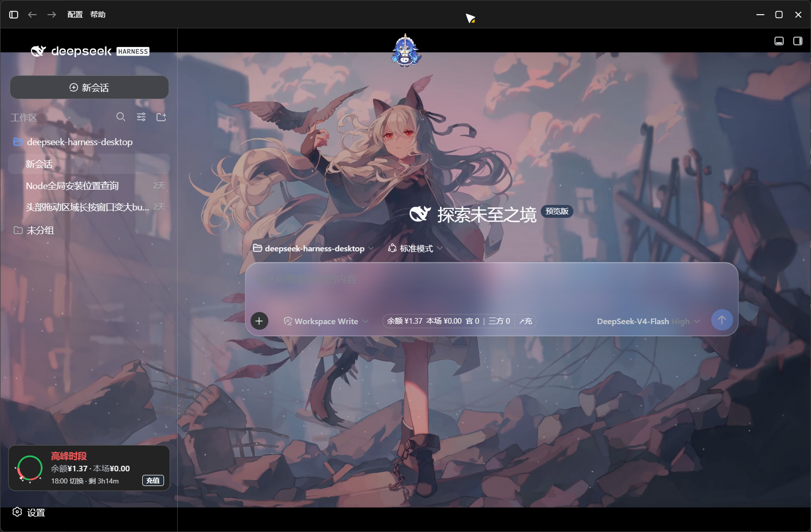

# DSH 桌面壳对比

三款将 DeepSeek Harness CLI 包装为桌面应用的社区项目对比。

测试环境全局已安装nodejs、dsh，以及部分插件，已知采用wallpaper-engine插件。

---

## 截图对比

|                           本项目                           |                   anywhere-labs                   |                        Tauri 版                        |
| :---------------------------------------------------------: | :-----------------------------------------------: | :----------------------------------------------------: |
|  |  |  |

---

## 对比表格

| 维度                   |       本项目 (Simple)       |      anywhere-labs      |        Tauri 版        |
| ---------------------- | :-------------------------: | :---------------------: | :---------------------: |
| **框架**         |         Electron 43         |       Electron 28       |         Tauri 2         |
| **前端**         |     纯原生 HTML/CSS/JS     |      React + Vite      |      React + Vite      |
| **代码量**       |          ~3.5k 行          |         ~8k 行         |         ~15k 行         |
| **运行时捆绑**   |          ❌ 不捆绑          |       ✅ 捆绑 dsh       |        ❌ 不捆绑        |
| **第三方依赖**   | 1 个 (`electron-menubar`) |          多个          |    多个 (Rust crate)    |
| **托盘**         |        ✅ 类原生自绘        |       ✅ 系统托盘       |       ✅ 系统托盘       |
| **全局快捷键**   |          ✅ 可录制          |           ✅           |           ✅           |
| **开机自启**     |             ✅             |           ❌           |           ❌           |
| **窗口拖拽**     |       ✅ 自定义标题栏       |      ✅ 系统标题栏      |      ✅ 系统标题栏      |
| **Acrylic 背景** |             ✅             |           ❌           |           ❌           |
| **设置页**       |     ✅ 环境检测 + 日志     |           ❌           |         ✅ 基础         |
| **安全隔离**     |         ✅ sandbox         |        ⚠️ 部分        |           ✅           |
| **打包格式**     |       NSIS + Portable       |          NSIS          |       MSI + NSIS       |
| **平台**         |           Windows           | Windows / macOS / Linux | Windows / macOS / Linux |
| **自动更新**     |           ❌ 手动           |           ❌           |           ✅           |

---

## anywhere-labs (dsh-desktop)

**仓库**：[anywhere-labs/dsh-desktop](https://github.com/anywhere-labs/dsh-desktop)

### 优势

- **多平台支持**：Windows、macOS、Linux 三平台完整构建配置
- **捆绑运行时**：内置 dsh，用户无需预装环境，下载即用
- **成熟度高**：较早的社区项目，Stars 和用户基数较大
- **React 生态**：前端使用 React + Vite，便于二次开发

### 劣势

- **体积大**：捆绑 dsh 运行时导致安装包体积显著增加
- **耦合度高**：内置 dsh 版本固定，升级需发新版，无法跟随系统 dsh 升级
- **依赖多**：引入 React、Vite 等前端构建链，代码量 ~8k 行
- **功能缺失**：无开机自启、无环境检测、无日志管理
- **安全较弱**：contextIsolation 配置不够严格，部分窗口未启用 sandbox
- **窗口体验**：使用系统原生标题栏，无法自定义拖拽区域和亚克力效果

---

## Tauri 版 (deepseek-harness-desktop)

**仓库**：[Hyrinx/deepseek-harness-desktop](https://github.com/Hyrinx/deepseek-harness-desktop)（Tauri 分支）

### 优势

- **Tauri 2 框架**：基于 Rust，内存占用更低，启动更快
- **多平台**：Windows、macOS、Linux 三平台
- **自动更新**：内置 Tauri updater，支持自动更新
- **安全**：Tauri 沙箱模型，CSP 严格限制
- **现代前端**：React + Vite，热更新开发体验好

### 劣势

- **代码量大**：~15k 行，Rust 后端 + React 前端，维护成本高
- **Rust 门槛**：需要 Rust 工具链，贡献门槛较高
- **编译慢**：Rust 编译耗时，CI/CD 构建时间长
- **依赖重**：Cargo.toml 引入多个 Rust crate，npm 引入 React 全家桶
- **不捆绑 dsh**：与 Simple 版一样需预装环境，但未提供环境检测引导
- **设置页简陋**：仅基础配置，无环境检测、日志管理
- **窗口体验**：系统原生标题栏，无自定义拖拽和亚克力效果

---

## 本项目定位

**DeepSeek Harness Desktop Simple** 的核心理念是 **「简介」**：

- 代码量最小（~3.5k 行），零前端框架，纯原生实现
- 仅 1 个第三方运行时依赖（`electron-menubar`）
- 桌面体验完整：自定义标题栏拖拽、Acrylic 亚克力背景、类原生自绘托盘
- 设置页功能齐全：环境检测 + 一键更新 + 日志管理 + 快捷键录制 + 开机自启
- 安全到位：`contextIsolation` + `sandbox` + 权限拒绝 + 导航限制

**适合人群**：希望代码简洁、易于理解和修改的开发者；偏好「薄壳」理念、不愿捆绑运行时的用户。

---

## 总结

| 如果你需要...                      | 推荐                        |
| ---------------------------------- | --------------------------- |
| 下载即用、不关心体积               | anywhere-labs (dsh-desktop) |
| 跨平台、自动更新、不在意 Rust 门槛 | Tauri 版                    |
| 代码简洁、易修改、桌面体验好       | **本项目 (Simple)**   |
